<div align="center">

# 🎯 Real-Time Computer Vision Pipeline
## OpenCV • YuNet • YOLOv8 • Classical Vision

### 🚀 Deep Learning PR 3 — From Pixel Processing to Real-Time AI Detection


</div>

---

## ✨ Project Overview

This project builds a complete **computer vision pipeline** that starts with classical image processing and progressively moves toward real-time deep-learning detection.

It covers **five end-to-end tasks**:

| Task | Topic | Main Output |
|---|---|---|
| 1 | Morphological Operations | Erosion, dilation, opening, closing, kernel comparison |
| 2 | Bitwise Operations & Histograms | Masking, ROI, grayscale/color histograms, brightness/contrast |
| 3 | YuNet Face Detection | Boxes, landmarks, confidence, webcam, threshold tuning, privacy blur |
| 4 | YOLOv8 Object Detection | Multi-class detection, webcam, confidence/IoU tuning, class summary |
| 5 | Integrated Pipeline | YuNet + YOLO together, preprocessing, FPS benchmarking, final comparison |

---

## 🎬 Visual Project Highlights

<div align="center">

### Morphological Operations
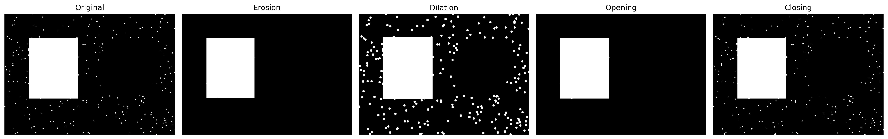

### Bitwise Operations
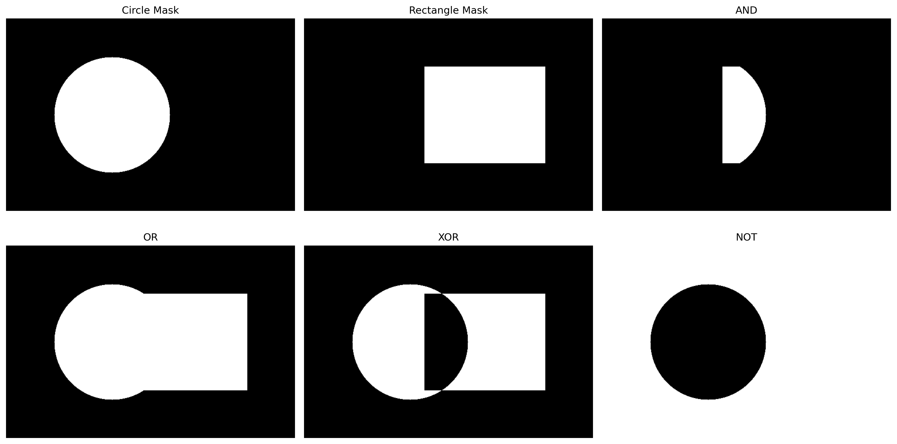

### YuNet Face Detection
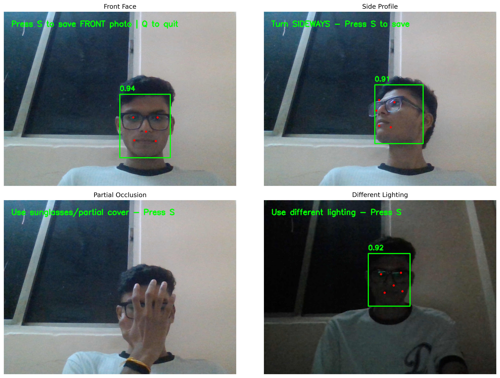

### YOLOv8 Static Detection
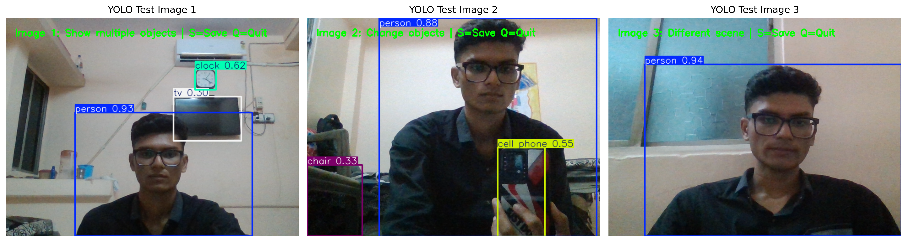

### Integrated YuNet + YOLO Pipeline
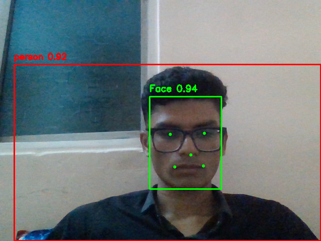

</div>

---

## 🧰 Tech Stack

<div align="center">

| Technology | Purpose |
|---|---|
| **Python** | Core programming language |
| **OpenCV** | Image processing and YuNet face detection |
| **NumPy** | Numerical and matrix operations |
| **Matplotlib** | Visualizations and result plots |
| **Pandas** | Final comparison table |
| **Ultralytics YOLOv8** | Real-time object detection |
| **YuNet** | Lightweight face detection |
| **Jupyter Notebook / VS Code** | Development environment |

</div>

---

## 📁 Repository Structure

```text
real-time-computer-vision-pr3/
│
├── cv_PR3.ipynb
├── README.md
├── requirements.txt
├── yolov8n.pt
│
├── data/
│   ├── images/
│   │   ├── morphology_color.png
│   │   ├── morphology_test.png
│   │   ├── faces/
│   │   │   ├── face_front.png
│   │   │   ├── face_side.png
│   │   │   ├── face_occlusion.png
│   │   │   └── face_extra.png
│   │   └── yolo/
│   │       ├── yolo_image1.png
│   │       ├── yolo_image2.png
│   │       └── yolo_image3.png
│   │
│   └── models/
│       └── face_detection_yunet_2023mar.onnx
│
└── plots/
    ├── morphology_grid.png
    ├── bitwise_operations.png
    ├── face_detection_comparison.png
    ├── face_privacy_blur.png
    ├── yunet_threshold_comparison.png
    ├── yolo_static_detection.png
    ├── yolo_threshold_comparison.png
    ├── yolo_class_summary.png
    ├── fps_comparison.png
    ├── integrated_pipeline.png
    └── results_table.png
```

---

# 🧪 Task 1 — Morphological Operations

The first stage focuses on **classical binary-image processing** using OpenCV.

### Operations Implemented

- Erosion
- Dilation
- Opening
- Closing
- Kernel comparison using `RECT`, `ELLIPSE`, and `CROSS`
- Kernel sizes: `3×3`, `5×5`, and `9×9`

### Key Concepts

- **Erosion** behaves like a local minimum filter and shrinks bright foreground regions.
- **Dilation** behaves like a local maximum filter and expands bright foreground regions.
- **Opening** removes small bright noise.
- **Closing** fills small dark holes and gaps.

<div align="center">

</div>

---

# 🎭 Task 2 — Bitwise Operations & Histograms

This task demonstrates pixel-level logical operations and image-intensity analysis.

### Bitwise Operations

- `AND`
- `OR`
- `XOR`
- `NOT`
- ROI masking
- Image compositing

### Histogram Analysis

- Grayscale histogram
- BGR channel histograms
- Brightness and contrast transformations

```python
new_pixel = alpha * pixel + beta
```

Where:

- `alpha` controls **contrast**
- `beta` controls **brightness**

<div align="center">

</div>

Histograms help diagnose **under-exposure, over-exposure, low contrast, and preprocessing requirements** before deep-learning detection.

---

# 🙂 Task 3 — Face Detection with YuNet

YuNet is used as a lightweight deep-learning face detector for static images and live webcam input.

### Face Conditions Tested

- Front-facing face
- Side profile
- Partial occlusion
- Different lighting

### Output Per Face

- Bounding box
- Five facial landmarks
- Confidence score

### Additional Experiments

- Real-time webcam face detection
- Score thresholds: `0.5`, `0.7`, `0.9`
- Privacy anonymization using Gaussian blur

<div align="center">

### Static Face Detection


### Threshold Comparison
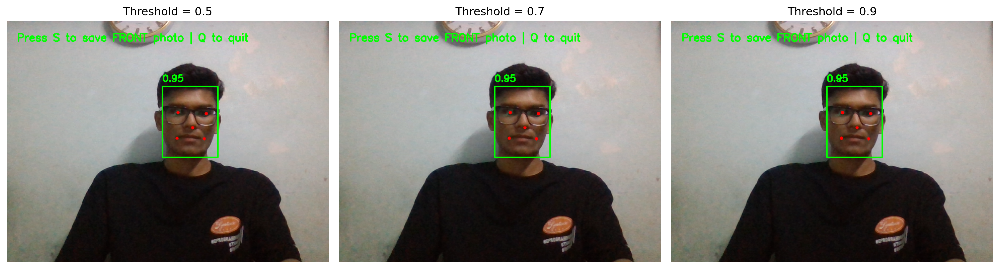

### Privacy Blur
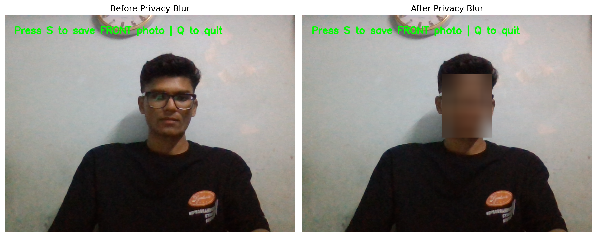

</div>

---

# 🚘 Task 4 — Object Detection with YOLOv8

The project uses **YOLOv8 Nano (`yolov8n.pt`)**, a lightweight object detector pretrained on the COCO dataset.

### Features Implemented

- Static object detection
- Webcam object detection
- Confidence threshold tuning
- IoU threshold tuning
- Non-Maximum Suppression discussion
- Per-class detection counting

<div align="center">

</div>

## 📊 Static Detection Results

| Test Image | Detected Objects |
|---|---:|
| Image 1 | 3 |
| Image 2 | 3 |
| Image 3 | 1 |

### Per-Class Summary

| Class | Count |
|---|---:|
| person | 3 |
| clock | 1 |
| tv | 1 |
| cell phone | 1 |
| chair | 1 |

<div align="center">
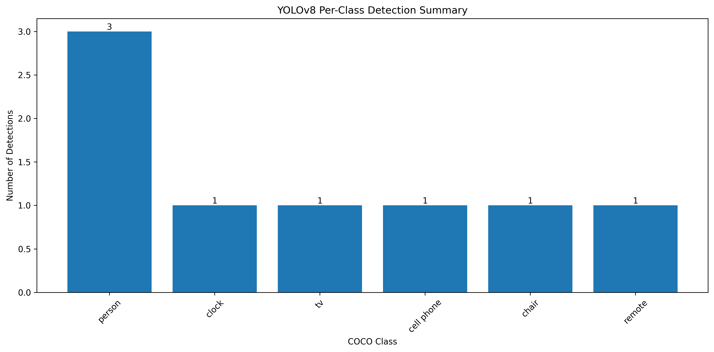
</div>

## 🎚 Confidence & IoU Tuning

Confidence values tested:

```text
0.25, 0.50, 0.75
```

IoU values tested:

```text
0.30, 0.50, 0.70
```

<div align="center">
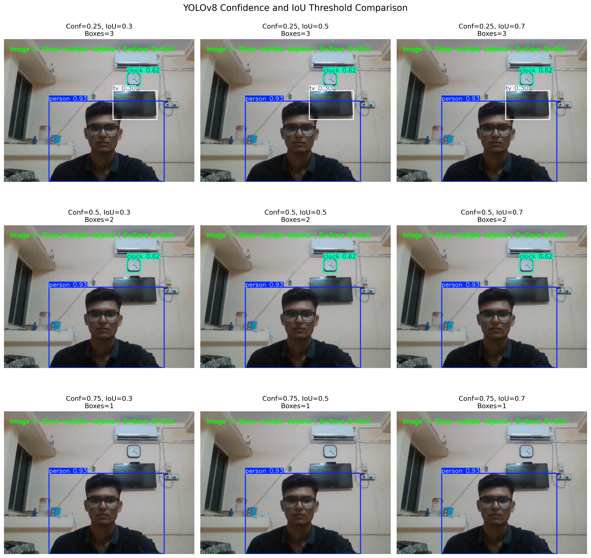
</div>

### Why YOLO?

YOLO is a **single-stage detector** that predicts bounding boxes and object classes in one forward pass. This makes it highly suitable for real-time use cases. The Nano variant provides a strong speed-versus-compute trade-off for laptops and edge systems.

---

# 🔗 Task 5 — Integrated Real-Time Pipeline

The final stage combines multiple techniques into one unified computer vision system.

### Integrated Pipeline

- **YuNet** → green face boxes and landmarks
- **YOLOv8** → red object boxes and labels
- **Optional morphology** → light noise preprocessing
- **FPS measurement** → real-time performance analysis

<div align="center">

</div>

---

## ⚡ FPS Benchmark

The project measured average performance for YuNet, YOLOv8, and the full combined pipeline.

| Pipeline | Average FPS |
|---|---:|
| YuNet Face Detection | **17.46 FPS** |
| YOLOv8 Object Detection | **18.08 FPS** |
| Combined YuNet + YOLO | **7.84 FPS** |

<div align="center">
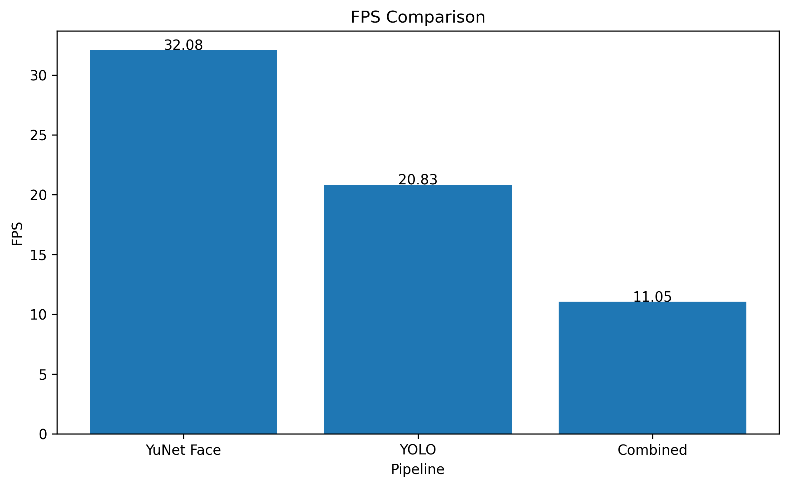
</div>

### Observation

The combined pipeline is slower because **two deep-learning detectors are executed for every frame**. Even so, it demonstrates a realistic integrated CV workflow.

---

## 📊 Final Technique Comparison

| Technique | Type | What It Detects / Analyzes | Lighting Robustness | Approx. FPS | Best Use Case |
|---|---|---|---|---|---|
| Morphological Operations | Classical | Image shape / noise | Low | N/A | Noise removal |
| Bitwise Operations | Classical | ROI and binary regions | Low | N/A | Masking and ROI |
| Histograms | Classical | Pixel intensity distribution | Diagnostic | N/A | Image quality analysis |
| YuNet Face Detection | Deep Learning | Human faces | High | **17.46** | Face detection |
| YOLOv8 Object Detection | Deep Learning | Multiple COCO objects | High | **18.08** | Object detection |

<div align="center">
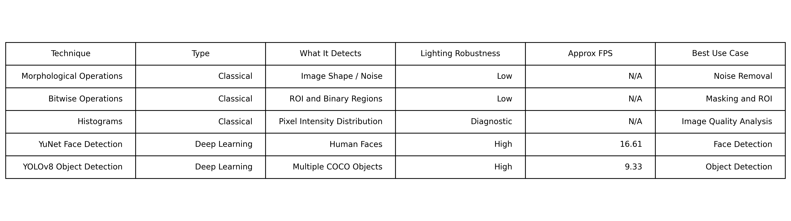
</div>

---

# 💡 Final Reflection

This project demonstrates that **classical computer vision and deep learning work best when used together**.

For a **low-power edge device**:

- Use YOLOv8 Nano
- Use YuNet with an optimized confidence threshold
- Apply lightweight `3×3` morphology only when needed
- Reduce camera resolution when higher FPS is required

For a **cloud or high-performance system**:

- Use larger YOLO variants such as YOLOv8s or YOLOv8m
- Increase input resolution
- Use stronger preprocessing when beneficial
- Prioritize detection accuracy over maximum frame rate

The measured results show that standalone YuNet and YOLO each achieved around **17–18 FPS**, while the combined real-time pipeline achieved **7.84 FPS**.

---

# 📦 Models & Data Sources

## YuNet

Model used:

```text
data/models/face_detection_yunet_2023mar.onnx
```

Source: OpenCV Zoo  
https://github.com/opencv/opencv_zoo/tree/main/models/face_detection_yunet

## YOLOv8

Model used:

```text
yolov8n.pt
```

Source: Ultralytics  
https://docs.ultralytics.com/

## Images

The repository contains custom face/object images and generated morphology images used throughout the notebook.

---

# ⚙️ Installation & Setup

### 1. Clone the Repository

```bash
git clone https://github.com/YOUR-USERNAME/real-time-computer-vision-pr3.git
cd real-time-computer-vision-pr3
```

### 2. Install Dependencies

```bash
python -m pip install -r requirements.txt
```

### 3. Open Notebook

```text
cv_PR3.ipynb
```

Run all notebook cells from top to bottom.

> **Note:** Webcam sections require camera permission. Press `Q` to close live detection windows when instructed.

---

# 🧾 Key Results

- ✅ Completed erosion, dilation, opening, and closing
- ✅ Compared kernel shape and size combinations
- ✅ Demonstrated AND, OR, XOR, NOT and masked ROI operations
- ✅ Plotted grayscale and BGR histograms
- ✅ Performed brightness/contrast analysis
- ✅ Ran YuNet on multiple face conditions
- ✅ Added facial landmarks and confidence scores
- ✅ Added privacy blur for detected faces
- ✅ Ran YOLOv8 on three static test images
- ✅ Detected **7 total objects** across static YOLO test images
- ✅ Benchmarked YuNet at **17.46 FPS**
- ✅ Benchmarked YOLOv8 at **18.08 FPS**
- ✅ Benchmarked the combined pipeline at **7.84 FPS**
- ✅ Built one integrated YuNet + YOLO real-time pipeline

---

# 🎥 Project Demo Video

<div align="center">

### ▶️ Watch the Full Demo

**Video Link:** `YOUR_VIDEO_LINK_HERE`

</div>

The video should demonstrate:

- Morphology outputs
- Histogram analysis
- YuNet static + webcam detection
- YOLO static + webcam detection
- Integrated YuNet + YOLO pipeline
- FPS comparison
- Final results table

---

# 🌟 Project Workflow

```text
Input Image / Webcam
        ↓
Classical Preprocessing
(Morphology + Histograms)
        ↓
YuNet Face Detection
        ↓
YOLOv8 Object Detection
        ↓
Integrated Annotation Layer
        ↓
FPS Benchmark + Final Analysis
```

---

# 👨‍💻 Author

<div align="center">

## Tushar Vala

**Data Analyst | AI/ML & Computer Vision Enthusiast**


</div>

---

<div align="center">


</div>
